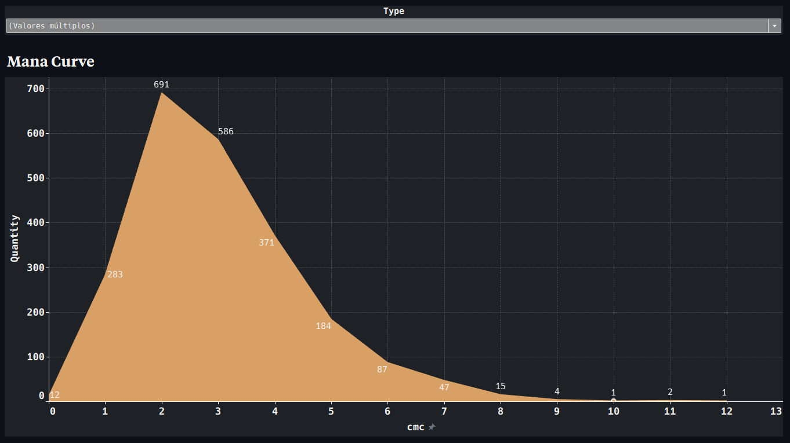
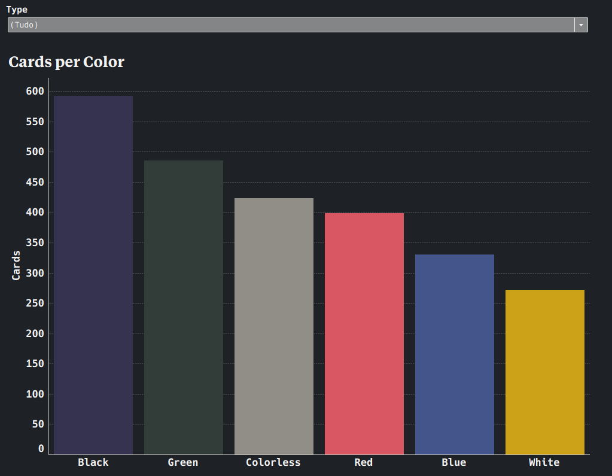
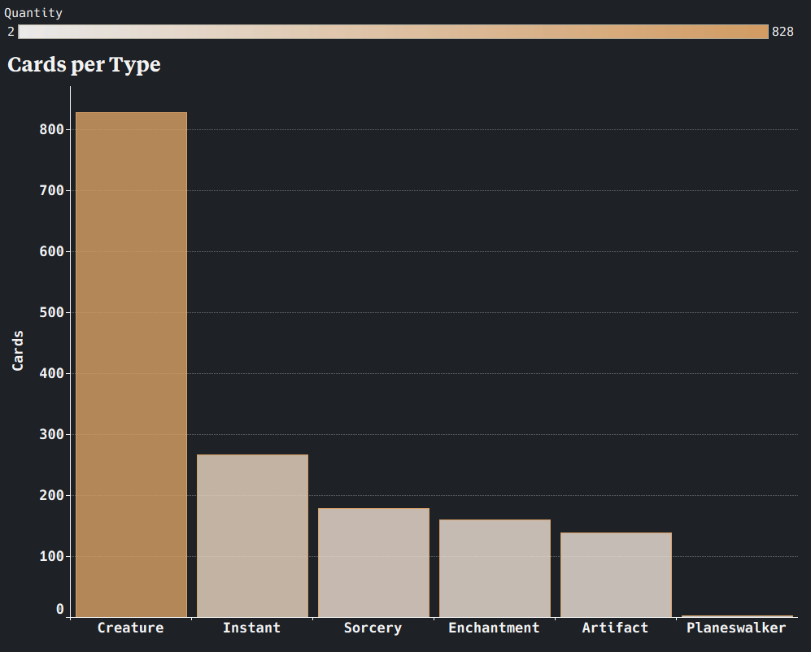
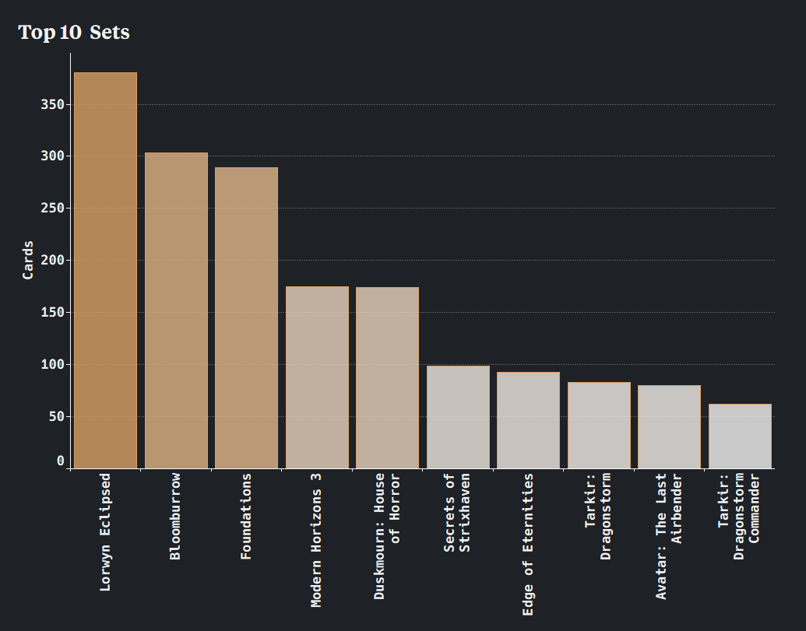

# MTG Collection Dashboard

Analysis of my personal Magic: The Gathering collection using ManaBox export data enriched with the Scryfall API.

## Stack

Python · Pandas · PostgreSQL · Tableau (in progress)

## Structure

```text
mtg-collection-dashboard/
│
├── data/
│   ├── processed/                      # intermediate .csv files
|   |   ├── cleaned_collection.csv
|   |   ├── merged_collection.csv
|   |   └── scryfall_data.csv 
│   └── raw/                            # raw data exported from Manabox
|       ├── manabox_collection-01.csv
|       └── manabox_collection-02.csv                        
├── notebooks/                          
│   ├── 01_cleanup.ipynb                # first cleanup of data, merging raw datasets
│   ├── 02_transform.ipynb              # modeling data and export to PostgreSQL
│   └── 03_metrics.ipynb                # first metrics directly in Python
│
├── src/
│   ├── cleanup.py                      
│   └── scryfall.py                     # Scryfall API call 
│
├── dashboard/                          # In progress
│   └── tableau/                        
│
├── images/
│   ├── pipeline.png
│   ├── tableau_cards-color.png
│   ├── tableau_cards-type.png
│   ├── tableau_mana-curve.png
│   └── tableau_top-10.png
│
├── .env.exemple
├── .gitignore
├── README.md                           # You're here!
└── requirements.txt
```

## Pipeline


## Dashboard previews






## Setup

1. Clone the repo
2. Create a `.env` file based on `.env.example`
3. Add your ManaBox CSV exports to `data/raw/`
4. Run the notebooks in order

## Data

Collection data exported from [ManaBox](https://manabox.app).  
Card metadata from the [Scryfall API](https://scryfall.com/docs/api)
