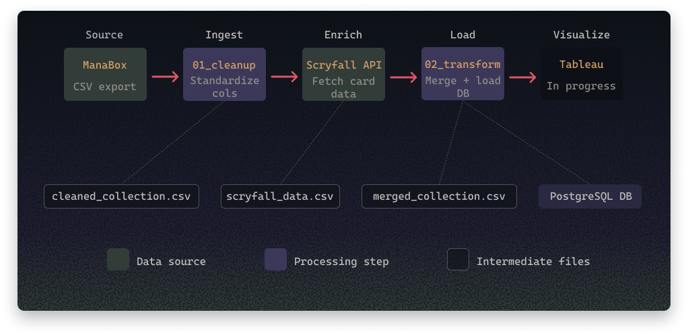

# MTG Collection Dashboard

Analysis of my personal Magic: The Gathering collection using ManaBox export data enriched with the Scryfall API.

## Stack

Python · Pandas · PostgreSQL · Tableau (in progress)

## Pipeline

## Setup

1. Clone the repo
2. Create a `.env` file based on `.env.example`
3. Add your ManaBox CSV exports to `data/raw/`
4. Run the notebooks in order

## Data

Collection data exported from [ManaBox](https://manabox.app).  
Card metadata from the [Scryfall API](https://scryfall.com/docs/api)
